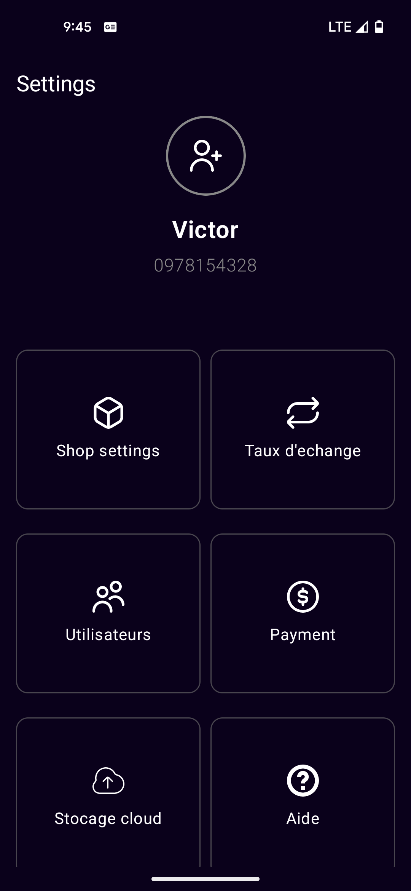
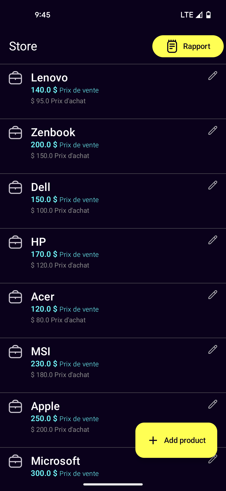
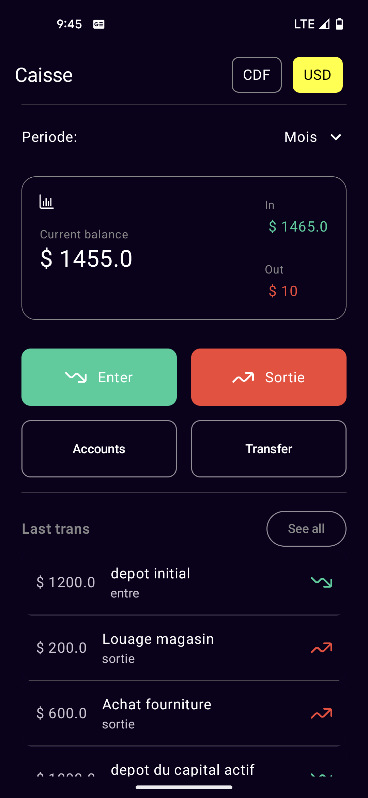
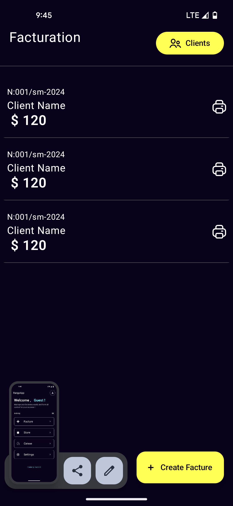

---
# RangoApp
# Application Mobile de Gestion de Stock, Vente et Facturation

## Description
Cette application mobile permet aux utilisateurs de gérer efficacement leurs stocks, de suivre les ventes et de générer des factures. Elle est conçue pour les petites et moyennes entreprises afin de faciliter la gestion quotidienne des opérations commerciales.

<p style="display:flex;">
  
  
 
 
</p>


## Fonctionnalités
- **Gestion de Stock** : Suivi des niveaux de stock, ajout de nouveaux produits, mise à jour des quantités.
- **Suivi des Ventes** : Enregistrement des ventes, suivi des ventes par produit, historique des ventes.
- **Facturation** : Génération de factures, envoi de factures par email, suivi des paiements.
- **Rapports** : Génération de rapports sur les stocks, les ventes et les factures.
- **Notifications** : Alertes pour les niveaux de stock bas, rappels de paiements.

## Installation

### Prérequis
- Android Studio
- Un émulateur ou un appareil physique pour tester l'application
- Kotlin pour le développement avec Jetpack Compose

### Étapes d'installation

1. Clonez le dépôt :
    ```bash
    git clone https://github.com/leenorshn/rangoapp.git
    ```
2. Ouvrez le projet dans Android Studio :
    - Lancez Android Studio
    - Sélectionnez "Open an existing project"
    - Naviguez jusqu'au répertoire cloné et sélectionnez-le
3. Synchronisez les dépendances Gradle :
    - Android Studio devrait automatiquement détecter le fichier `build.gradle` et télécharger les dépendances nécessaires.
4. Lancez l'application sur un émulateur ou un appareil physique :
    - Sélectionnez l'émulateur ou l'appareil physique dans la barre d'outils d'Android Studio.
    - Cliquez sur le bouton "Run" (triangle vert) pour lancer l'application.

## Utilisation

### Connexion
- Créez un compte ou connectez-vous avec des informations d'identification existantes.

### Gestion de Stock
- Ajoutez de nouveaux produits avec des détails tels que le nom, la description, le prix et la quantité.
- Mettez à jour les quantités de stock en temps réel.

### Suivi des Ventes
- Enregistrez les ventes effectuées avec les détails des produits vendus.
- Consultez l'historique des ventes pour analyser les tendances.

### Facturation
- Créez et envoyez des factures personnalisées aux clients.
- Suivez les paiements et gérez les factures en attente.

### Rapports
- Générez des rapports détaillés sur les stocks, les ventes et les factures pour une meilleure prise de décision.

## Contribution

Les contributions sont les bienvenues ! Pour signaler un problème ou proposer une amélioration, veuillez ouvrir une issue ou soumettre une pull request.

### Processus de contribution

1. Forkez le projet
2. Créez votre branche de fonctionnalité (`git checkout -b feature/AmazingFeature`)
3. Commitez vos modifications (`git commit -m 'Add some AmazingFeature'`)
4. Poussez vers la branche (`git push origin feature/AmazingFeature`)
5. Ouvrez une pull request

## License
Ce projet est sous licence MIT-privee. Voir le fichier [LICENSE](LICENSE) pour plus de détails.

## Auteurs

- 
(https://github.com/leenorshn)
#### Victor Shukuru @leenorshn

## Remerciements
- Merci à tous les contributeurs et utilisateurs de cette application.

---

N'hésitez pas à personnaliser ce modèle selon les spécificités de votre projet et vos préférences personnelles.
